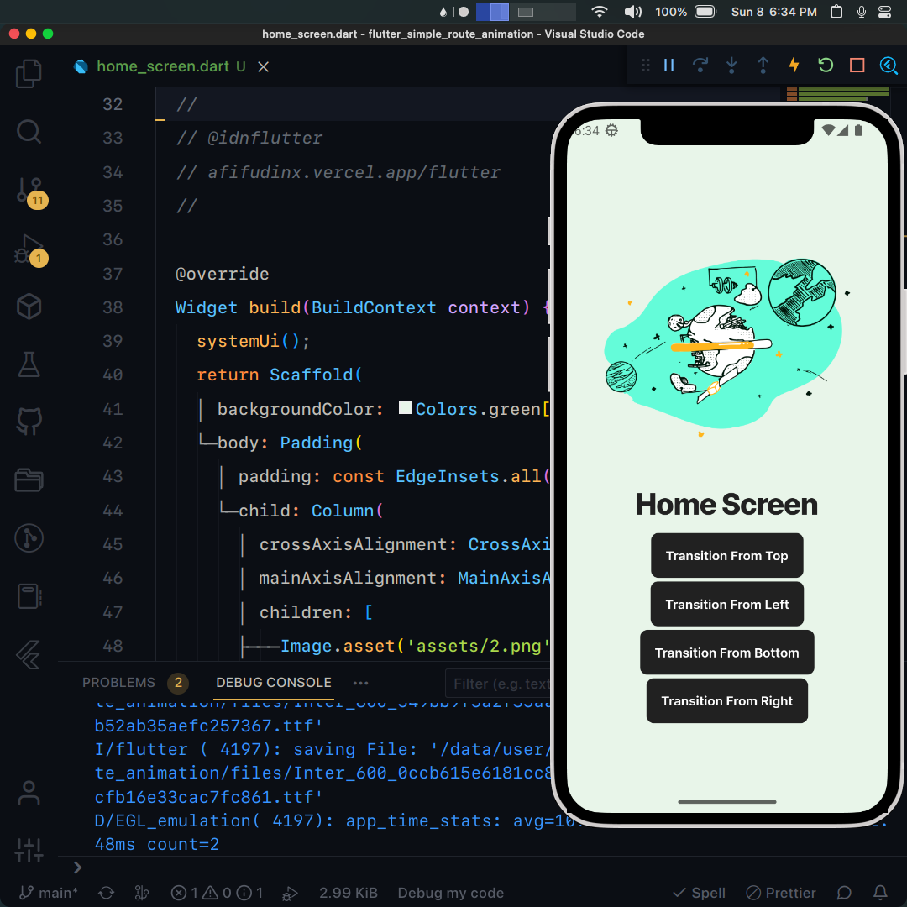

## Flutter UI - Simple Route Animation

```dart
void main() => runApp(MaterialApp(
      debugShowCheckedModeBanner: false,
      initialRoute: '/',
      onGenerateRoute: (settings) {
        if (settings.name == '/second') {
          final arguments = settings.arguments as TransitionArguments;
          return RouteAnimation.slide(
              settings, arguments.offset, const SecondScreen());
        } else {
          return RouteAnimation.slide(
              settings, const Offset(1, 0), const HomeScreen());
        }
      },
    ));
```

## Development Setup
```
git clone https://github.com/afifcodes/flutter-simple-route-animation-example.git
cd flutter-simple-route-animation-example
flutter pub get
flutter run
```

## Screenshots


## Links

* [Website](https://afifcodes.vercel.app/flutter)
* [Youtube channel](https://youtube.com/afifcodes)
* [Instagram](https://instagram.com/afifcodes)
